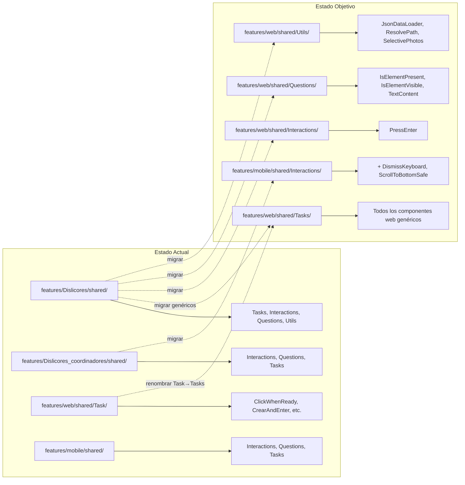

# Documento de Diseño — Limpieza de Arquetipo QA/SDET

## Visión General

Este diseño detalla la estrategia técnica para consolidar el proyecto QA/SDET en un arquetipo limpio y reutilizable. El trabajo se divide en cuatro fases principales:

1. **Migración Web** (Req 1-4): Copiar componentes genéricos de `features/Dislicores/shared/` a `features/web/shared/`
2. **Corrección Web** (Req 5): Corregir inconsistencias, typos y anti-patrones en `features/web/shared/`
3. **Eliminación Dislicores Web** (Req 6-10): Eliminar carpeta Dislicores, configs, scripts, env files y verificar integridad
4. **Consolidación Mobile** (Req 11-14): Migrar Interactions de Dislicores_coordinadores a mobile/shared, eliminar carpeta y documentar mejoras

### Decisiones de Diseño

- **Copiar, no mover**: Los archivos se copian primero a su destino y luego se elimina el origen completo, evitando estados intermedios rotos.
- **Renombrar carpeta antes de migrar**: La carpeta `shared/Task/` se renombra a `shared/Tasks/` antes de copiar archivos nuevos, para que todo quede consistente desde el inicio.
- **Orden de ejecución**: Migración → Corrección → Eliminación → Verificación. Esto garantiza que los componentes genéricos estén disponibles antes de eliminar las fuentes.
- **Imports relativos**: Todos los archivos migrados usan imports relativos a su nueva ubicación o paquetes `@serenity-js/*`, sin dependencias cruzadas entre módulos.

## Arquitectura

### Estructura Actual vs. Estructura Objetivo



### Estructura de Carpetas Objetivo

```
features/
├── web/
│   ├── Features/
│   ├── Tasks/
│   │   ├── Form/
│   │   └── Utils/              # pause.ts ELIMINADO
│   ├── UI/
│   ├── Questions/
│   ├── Data/
│   └── shared/
│       ├── Interactions/
│       │   └── PressEnter.ts           # NUEVO (desde Dislicores)
│       ├── Questions/
│       │   ├── TextContent.ts          # existente
│       │   ├── IsElementPresent.ts     # NUEVO (desde Dislicores)
│       │   └── IsElementVisible.ts     # NUEVO (desde Dislicores)
│       ├── Tasks/                      # RENOMBRADO (era Task/)
│       │   ├── ClickWhenReady.ts       # existente
│       │   ├── ClearAndEnter.ts        # RENOMBRADO (era CrearAndEnter.ts)
│       │   ├── ReplaceValue.ts         # CORREGIDO (sin console.log)
│       │   ├── SelectFromDropdown.ts   # existente
│       │   ├── WaitUntilGone.ts        # NUEVO (desde Dislicores)
│       │   ├── SelectNativeOptionByText.ts   # NUEVO (desde Dislicores)
│       │   └── SelectNativeOptionByValue.ts  # NUEVO (desde Dislicores)
│       ├── Utils/
│       │   ├── JsonDataLoader.ts       # existente
│       │   ├── ResolvePath.ts          # existente
│       │   └── SelectivePhotos.ts      # NUEVO (desde Dislicores)
│       └── data/
│           └── types/
├── mobile/
│   ├── android/
│   │   ├── Features/
│   │   ├── Tasks/
│   │   │   └── Login/
│   │   │       └── LoginTasks.ts       # HomeTasks copy.ts ELIMINADO
│   │   └── UI/
│   └── shared/
│       ├── Interactions/
│       │   ├── DebugPause.ts           # existente
│       │   ├── Swipe.ts               # existente
│       │   ├── Tap.ts                 # existente
│       │   ├── TypeInto.ts            # existente
│       │   ├── WaitFor.ts            # existente
│       │   ├── DismissKeyboard.ts     # NUEVO (desde Dislicores_coordinadores)
│       │   └── ScrollToBottomSafe.ts  # NUEVO (desde Dislicores_coordinadores)
│       ├── Questions/                 # sin cambios
│       └── Tasks/                     # sin cambios
├── step-definitions/
│   ├── web/                           # sin cambios
│   └── mobile/                        # sin cambios
│   # dislicores_web/ ELIMINADO
│   # dislicores_mobile/ ELIMINADO
├── support/                           # sin cambios
# Dislicores/ ELIMINADO
# Dislicores_coordinadores/ ELIMINADO
```


## Componentes e Interfaces

### Fase 1: Migración Web (Requisitos 1-4)

#### 1.1 Tasks genéricas a migrar (Req 1)

| Archivo Origen | Archivo Destino | Acción |
|---|---|---|
| `Dislicores/shared/Tasks/WaitUntilGone.ts` | `web/shared/Tasks/WaitUntilGone.ts` | Copiar tal cual (imports ya usan `@serenity-js`) |
| `Dislicores/shared/Tasks/SelectNativeOptionByText.ts` | `web/shared/Tasks/SelectNativeOptionByText.ts` | Copiar tal cual |
| `Dislicores/shared/Tasks/SelectNativeOptionByValue.ts` | `web/shared/Tasks/SelectNativeOptionByValue.ts` | Copiar tal cual |

Nota: Estos archivos se copian a `Tasks/` (plural), que será el nombre final de la carpeta tras el renombrado del Req 5.

#### 1.2 Interactions genéricas a migrar (Req 2)

| Archivo Origen | Archivo Destino | Acción |
|---|---|---|
| `Dislicores/shared/Interactions/PressEnter.ts` | `web/shared/Interactions/PressEnter.ts` | Copiar tal cual (imports usan `@serenity-js/core` y `@serenity-js/web`) |

#### 1.3 Questions genéricas a migrar (Req 3)

| Archivo Origen | Archivo Destino | Acción |
|---|---|---|
| `Dislicores/shared/Questions/IsElementPresent.ts` | `web/shared/Questions/IsElementPresent.ts` | Copiar tal cual |
| `Dislicores/shared/Questions/IsElementVisible.ts` | `web/shared/Questions/IsElementVisible.ts` | Copiar tal cual |

#### 1.4 Utils a migrar (Req 4)

| Archivo Origen | Archivo Destino | Acción |
|---|---|---|
| `Dislicores/shared/Utils/SelectivePhotos.ts` | `web/shared/Utils/SelectivePhotos.ts` | Copiar tal cual |

### Fase 2: Corrección Web (Requisito 5)

#### 2.1 Renombrar carpeta `Task/` → `Tasks/`

- Renombrar `features/web/shared/Task/` a `features/web/shared/Tasks/`
- Archivos afectados dentro: `ClickWhenReady.ts`, `CrearAndEnter.ts`, `ReplaceValue.ts`, `SelectFromDropdown.ts`

#### 2.2 Renombrar archivo con typo

- Renombrar `features/web/shared/Tasks/CrearAndEnter.ts` a `features/web/shared/Tasks/ClearAndEnter.ts`
- El contenido del archivo no cambia (la clase interna ya se llama `ClearAndEnter`)

#### 2.3 Actualizar imports afectados

Archivos que importan desde `shared/Task/` (singular) y deben actualizarse a `shared/Tasks/`:

| Archivo | Import Actual | Import Nuevo |
|---|---|---|
| `features/web/Tasks/Form/AbrirFormulario.ts` | `../../shared/Task/ClickWhenReady` | `../../shared/Tasks/ClickWhenReady` |
| `features/web/Tasks/Form/LlenarFormulario.ts` | `../../shared/Task/SelectFromDropdown` | `../../shared/Tasks/SelectFromDropdown` |
| `features/web/Tasks/Form/LlenarFormulario.ts` | `../../shared/Task/CrearAndEnter` | `../../shared/Tasks/ClearAndEnter` |
| `features/web/Tasks/Form/LlenarFormulario.ts` | `../../shared/Task/ReplaceValue` | `../../shared/Tasks/ReplaceValue` |

#### 2.4 Eliminar console.log de debug

En `features/web/shared/Tasks/ReplaceValue.ts`, eliminar la línea:
```typescript
console.log(value + "EL VALOR ES ESTEEEEEEEEEEEE")
```

#### 2.5 Eliminar anti-patrón pause.ts

- Eliminar `features/web/Tasks/Utils/pause.ts` (usa `setTimeout`, prohibido por AGENTS.md)
- Verificar que ningún archivo importe `pause.ts` antes de eliminar

### Fase 3: Eliminación Dislicores Web (Requisitos 6-9)

#### 3.1 Directorios a eliminar (Req 6)

| Directorio | Contenido |
|---|---|
| `features/Dislicores/` | Todo: Tasks, UI, Questions, Interactions, Data, Features, shared |
| `features/step-definitions/dislicores_web/` | `Home_steps.ts`, `Login_steps.ts` |
| `features/step-definitions/dislicores_mobile/` | `Mobile_login_steps.ts` |

#### 3.2 Archivos de configuración a eliminar (Req 7)

| Archivo | Razón |
|---|---|
| `configs/wdio.dislicores.web.conf.ts` | Config específica Dislicores web |
| `configs/wdio.dislicores.android.conf.ts` | Config específica Dislicores android |
| `.env.dislicores.web` | Variables env Dislicores web |
| `.env.dislicores.movil.android` | Variables env Dislicores mobile |

#### 3.3 Limpieza de scripts/run.mjs (Req 8)

Cambios requeridos en `scripts/run.mjs`:

1. **Eliminar carga de env Dislicores** (líneas con `dislicores_web` y `dislicores_movil`):
   ```javascript
   // ELIMINAR:
   if (mode === 'dislicores_web') envFile = '.env.dislicores.web';
   if (mode === 'dislicores_movil' && platform === 'android') { envFile = '.env.dislicores.movil.android'; }
   ```

2. **Eliminar entradas de modeToConfig**:
   ```javascript
   // ELIMINAR:
   dislicores_web: './configs/wdio.dislicores.web.conf.ts',
   dislicores_android: './configs/wdio.dislicores.android.conf.ts',
   ```

3. **Limpiar función resolveMobileConfig**: Eliminar el bloque `if (forMode === 'dislicores_movil')`

4. **Limpiar secuencia `all`**: Eliminar `'dislicores_web'` y `'dislicores_movil'` del array `sequence`

5. **Limpiar resolución de modo single**: Eliminar `'dislicores_movil'` de la condición de modos móviles

6. **Actualizar mensaje de error**: Cambiar el mensaje de modos soportados para excluir dislicores:
   ```javascript
   console.error(`Usa MODE=web|web_movil|movil|desktop|api o --mode=...`);
   ```

7. **Eliminar comentarios** que referencien dislicores en la documentación del archivo

#### 3.4 Limpieza de package.json (Req 8)

Eliminar scripts:
```json
"test:dislicores:android": "node ./scripts/run.mjs --mode=dislicores_movil --platform=android",
"test:dislicores:web": "node ./scripts/run.mjs --mode=dislicores_web",
```

#### 3.5 Limpieza de README.md (Req 8)

Eliminar todas las secciones que referencien:
- Modo `dislicores_web`
- Modo `dislicores_movil`
- Comandos `npm run test:dislicores:*`
- Variables de entorno `DISLICORES_*`
- Configs `wdio.dislicores.*.conf.ts`

#### 3.6 Actualización de AGENTS.md (Req 8)

- Eliminar `features/Dislicores/` de la estructura de carpetas
- Agregar nota: `# (consolidado en features/web/shared/)`
- Eliminar `dislicores_web/` y `dislicores_mobile/` de step-definitions

#### 3.7 Limpieza de variables de entorno (Req 9)

En `.env.web`:
- Eliminar: `DISLICORES_USER`, `DISLICORES_PASSWORD`, `DISLICORES_URL`
- Agregar placeholders genéricos:
  ```
  APP_USER=test_user
  APP_PASSWORD=test_password
  APP_URL=https://example.com
  ```

En `.env.movil.android`:
- Verificar si contiene variables `DISLICORES_*` y eliminarlas si existen
- (Actualmente no contiene variables DISLICORES explícitas, pero el `APP_PACKAGE` referencia `com.dislicores` — esto es configuración de la app específica del usuario, no del arquetipo)

### Fase 4: Consolidación Mobile (Requisitos 11-14)

#### 4.1 Interactions a migrar a mobile/shared (Req 11)

| Archivo Origen | Archivo Destino | Notas |
|---|---|---|
| `Dislicores_coordinadores/shared/Interactions/DismissKeyboard.ts` | `mobile/shared/Interactions/DismissKeyboard.ts` | Copiar tal cual. Imports: `@serenity-js/core`, `@wdio/globals`. Conservar tipo `Options` con `allowBackFallback` |
| `Dislicores_coordinadores/shared/Interactions/ScrollToBottom.ts` | `mobile/shared/Interactions/ScrollToBottomSafe.ts` | Copiar con nombre de archivo actualizado. Imports: `@serenity-js/core`, `@wdio/globals` |

#### 4.2 Correcciones mobile (Req 12)

| Acción | Archivo |
|---|---|
| Eliminar | `features/mobile/android/Tasks/Login/HomeTasks copy.ts` (placeholder sin implementación) |
| Eliminar | `features/Dislicores_coordinadores/android/Tasks/Login/HomeTasks copy.ts` (placeholder sin implementación) |

#### 4.3 Eliminación Dislicores_coordinadores (Req 13)

| Directorio/Archivo | Acción |
|---|---|
| `features/Dislicores_coordinadores/` | Eliminar directorio completo |
| `configs/wdio.dislicores.android.conf.ts` | Ya eliminado en Req 7 — verificar |
| `features/step-definitions/dislicores_mobile/` | Ya eliminado en Req 6 — verificar |
| `.env.dislicores.movil.android` | Ya eliminado en Req 7 — verificar |

Nota: Los requisitos 7, 8 y 13 comparten eliminaciones. La implementación debe ser idempotente (no fallar si el archivo ya fue eliminado).

#### 4.4 Actualización AGENTS.md para mobile (Req 12)

- Agregar `DismissKeyboard` y `ScrollToBottomSafe` a la lista de Interactions mobile:
  ```
  ├── Interactions/       # Tap, TypeInto, WaitFor, Swipe, DismissKeyboard, ScrollToBottomSafe
  ```
- Eliminar referencia a `features/Dislicores_coordinadores/` y `dislicores_mobile/`

#### 4.5 Documentación de mejoras mobile (Req 14)

Crear sección en `README.md` o documentar las mejoras identificadas:

1. ✅ `DismissKeyboard.ts` migrado a `mobile/shared/Interactions/` (Req 11)
2. ✅ `ScrollToBottomSafe.ts` migrado a `mobile/shared/Interactions/` (Req 11)
3. ✅ `HomeTasks copy.ts` eliminado (Req 12)
4. ⚠️ `LoginTasks.ts` en mobile no usa `DismissKeyboard` entre campos — mejora pendiente
5. ⚠️ `Mobile_login_steps.ts` contiene código comentado extenso — limpieza pendiente


## Modelos de Datos

No aplica. Este feature no introduce modelos de datos nuevos. Los archivos migrados mantienen sus interfaces y tipos existentes:

- `DismissKeyboard` usa tipo `Options = { allowBackFallback?: boolean }`
- `ScrollToBottomSafe` usa tipo `Options` con propiedades de configuración de scroll (`maxSwipes`, `safeBottomRatio`, `safeTopRatio`, `xRatio`, `pressMs`, `stableTriesToStop`, `tryDismissKeyboard`)
- Los componentes web (`Tasks`, `Questions`, `Interactions`) operan sobre abstracciones de Serenity/JS (`PageElement`, `Answerable<PageElement>`, `Key`, etc.)

## Manejo de Errores

### Durante la migración

- **Archivo ya existe en destino**: Si un archivo duplicado ya existe en el destino (ej: `ClickWhenReady.ts` existe en ambos), se mantiene la versión del destino (web/shared) ya que son idénticos según el análisis de hallazgos.
- **Import roto post-renombrado**: Todos los imports que referencian `shared/Task/` (singular) deben actualizarse a `shared/Tasks/` (plural). Los archivos afectados están identificados en la sección 2.3.
- **Eliminación de archivo referenciado**: Antes de eliminar `pause.ts`, verificar que no existan imports activos. Si existen, eliminar el import y el uso del `pause()`.

### Post-limpieza

- **Compilación TypeScript**: Ejecutar `npx tsc --noEmit` sobre los archivos de `features/web/` y `features/mobile/` para verificar que no hay errores de tipos.
- **Imports inválidos**: Verificar que ningún archivo en `features/step-definitions/web/` o `features/step-definitions/mobile/` importe desde rutas que ya no existen (`Dislicores/`, `Dislicores_coordinadores/`).

## Estrategia de Testing

### Enfoque

Este feature es una refactorización estructural (migración de archivos, renombrado, eliminación). No introduce lógica de negocio nueva ni funciones puras con comportamiento variable por input. Por lo tanto:

- **Property-Based Testing (PBT) NO aplica** a este feature. Las operaciones son de tipo configuración, migración de archivos y limpieza de referencias — no hay funciones con input/output variable donde propiedades universales aporten valor.
- **La verificación se basa en**:
  - Compilación exitosa de TypeScript (`tsc --noEmit`)
  - Validación de que los imports apuntan a rutas existentes
  - Verificación de que los archivos eliminados ya no existen
  - Verificación de que los archivos migrados existen en su destino

### Tests de verificación recomendados

1. **Verificación de integridad de imports** (Req 10, 14):
   - Ejecutar `npx tsc --noEmit` en el proyecto completo
   - Verificar 0 errores de compilación

2. **Verificación de eliminación** (Req 6, 7, 13):
   - Confirmar que `features/Dislicores/` no existe
   - Confirmar que `features/Dislicores_coordinadores/` no existe
   - Confirmar que `configs/wdio.dislicores.*.conf.ts` no existen
   - Confirmar que `.env.dislicores.*` no existen
   - Confirmar que `features/step-definitions/dislicores_*/` no existen

3. **Verificación de migración** (Req 1-4, 11):
   - Confirmar que los archivos migrados existen en su destino
   - Confirmar que los imports dentro de los archivos migrados son válidos

4. **Verificación de correcciones** (Req 5):
   - Confirmar que `features/web/shared/Tasks/` existe (plural)
   - Confirmar que `features/web/shared/Task/` NO existe (singular)
   - Confirmar que `ClearAndEnter.ts` existe (no `CrearAndEnter.ts`)
   - Confirmar que `ReplaceValue.ts` no contiene `console.log`
   - Confirmar que `pause.ts` no existe

5. **Verificación de scripts** (Req 8):
   - Confirmar que `scripts/run.mjs` no contiene la cadena `dislicores`
   - Confirmar que `package.json` no contiene scripts `test:dislicores:*`
